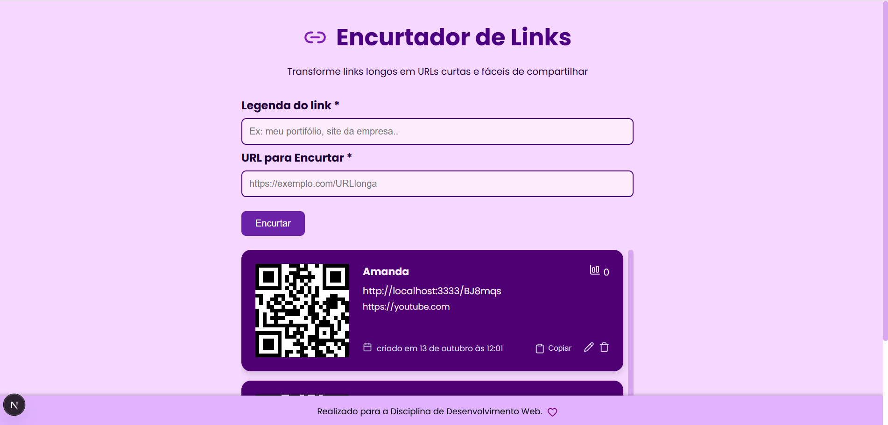

#  Encurtador de Links

##  Descrição do Projeto

O **Encurtador de Links** é uma aplicação web desenvolvida com o objetivo de transformar URLs longas em links curtos e fáceis de compartilhar. Este trabalho foi realizado para a disciplina de **Desenvolvimento Web 3**.  

O sistema foi desenvolvido possuindo duas partes principais:

- **Back-end (API):** responsável pela lógica de encurtamento e armazenamento dos links.
- **Front-end (Interface Web):** onde o usuário interage com a aplicação e visualiza o resultado.

---

##  Aplicação funcionando

- *Front-end:* [Acesse aqui](https://linksam.vercel.app)
- *Back-end:* [Acesse aqui](https://linksam-api.vercel.app)

---

##  Objetivo

O objetivo do projeto é aplicar os conhecimentos adquiridos na disciplina de **Desenvolvimento Web**, integrando conceitos de **front-end** e **back-end**.

---

#  Tecnologias Utilizadas

## Back-end

| Tecnologia | Descrição |
|------------|-----------|
|  | Plataforma para execução do JavaScript no servidor. |
|  | Framework web rápido e eficiente para Node.js. |
|  | ORM para manipulação e sincronização de banco de dados. |
|  | Banco de dados relacional utilizado. |
|  | Gerenciamento de variáveis de ambiente. |
|  | Linguagem utilizada no desenvolvimento do back-end. |

---

##  Front-end

| Tecnologia | Descrição |
|------------|-----------|
|  | Framework React com renderização híbrida. |
|  | Biblioteca para construção da interface de usuário. |
|  | Estilização modular, rápida e responsiva. |
|  | Comunicação entre o front-end e a API. |
|  | Geração de códigos QR. |
|  | Linguagem principal utilizada no front-end. |


---
## Imagem do Projeto


## Estrutura do Projeto

```bash
Encurtador_URL/
│
├── source/
│   ├── api/    → Código do back-end (Node, Fastify, Drizzle)
│   └── web/    → Código do front-end (React, Css Modules)
│
├── README.md
└── package.json
```

##  Como executar o projeto localmente

###  Clonar o repositório

```bash
git clone git@github.com:AmandaSoaresV/Encurtador_URL.git .
```

## Configurar o Back-end

Acesse o diretório da api
```bash
cd source/api
```

Instale as dependências
```bash
npm install
```

Crie o arquivo .env com as variáveis abaixo:

```bash
DATABASE_URL=""
PORT=3333
```

Sincronize as migrations

```bash
npx drizzle-kit migrate
```
```bash
npx drizzle-kit push 
```

Execute o servidor:
```bash
npm run dev
```

## Configurar o Front-end

Acesse o diretório do projeto web

```bash
cd source/web
```

Instale as dependências
```bash
npm install
```

Crie o arquivo .env:

```bash
api_url="http://localhost:3333"
```

Execute o projeto:
```bash
npm run dev
```

## Funcionalidade Extra

A funcionalidade adicional desenvolvida foi a **geração de QR Code** para cada link encurtado.
Essa melhoria foi implementada utilizando a **biblioteca react-qr-code**, permitindo que o usuário aponte a câmera do celular para acessar o link de forma rápida e prática.


## Desenvolvido por

| Nome                   | GitHub                                             |
| ---------------------- | -------------------------------------------------- |
| Amanda Soares Vieira   | [@AmandaSoaresV](https://github.com/AmandaSoaresV) |
| Matheus Teodoro Garcia | [@MatheusTG](https://github.com/MatheusTG)          |